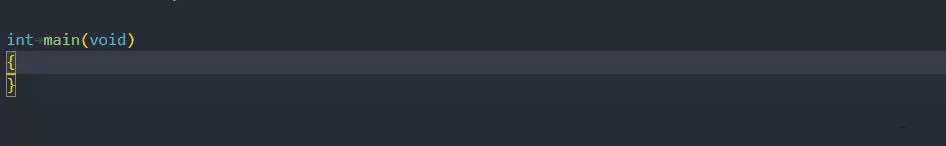

# 42 Norminette Checker

This extension will inject norm errors inside your code.



## Configuration

```ts
{
  "42norminette.command": string, // Default: 'norminette'
  "42norminette.maxErrors": number // Default: 1,
}
```

## Issues

In case of a bug, or missing feature, please create a [Github Pull Request](https://github.com/dalexhd/42-norminette/pulls).

## License

MIT